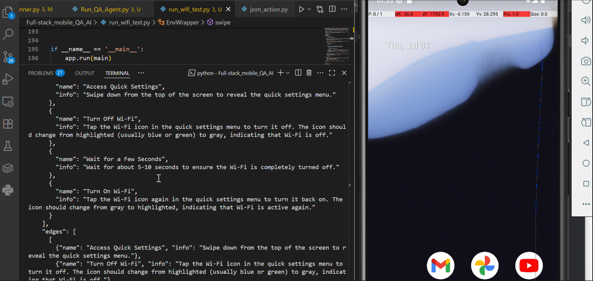

# Multi-Agent Mobile QA System

## 1. Overview

This project implements a multi-agent, LLM-powered system designed to function as a full-stack mobile QA team. The system is built on top of the **Agent-S** agentic framework and uses the **android_world** environment to interact with a live Android emulator. The goal is to automate complex, multi-step QA tasks on mobile applications by decomposing high-level goals into actionable steps, executing them, verifying the outcomes, and providing high-level analysis.

## 2. Architecture

The system is composed of four distinct agents that collaborate to complete QA tasks, extending the modular architecture of Agent-S.

* **Planner Agent (`Manager`)**: This agent, implemented by the `Manager` class within the Agent-S framework, is responsible for parsing high-level QA goals (e.g., "Test turning Wi-Fi on and off") and decomposing them into a logical sequence of smaller, actionable subgoals.
* **Executor Agent (`Worker`)**: Implemented by the `Worker` class in Agent-S, this agent receives subgoals from the Planner. It inspects the current UI hierarchy of the Android environment and generates grounded mobile gestures (e.g., `click`, `swipe`, `type`) to execute the subgoal.
* **Verifier Agent**: A custom-built agent that runs after each action executed by the Executor. It uses a multimodal LLM to analyze the new UI state and determines whether the application behaved as expected, returning a "PASS" or "FAIL" verdict.
* **Supervisor Agent**: A custom-built agent that runs after the entire test episode is complete. It analyzes the full log of actions, screenshots, and verifier verdicts to provide a high-level report. This report includes suggestions for improving the test plan, analyzing failures, and expanding test coverage.

## 3. Setup and Installation

Follow these steps to set up the project environment.

### Prerequisites
* Python 3.11
* Android Studio
* An OpenAI API Key

### Step-by-Step Guide

1.  **Clone Repositories**: Clone the `Agent-S` and `android_world` repositories into your main project folder.
    ```bash
    git clone [https://github.com/simular-ai/Agent-S.git](https://github.com/simular-ai/Agent-S.git)
    git clone [https://github.com/google-research/android_world.git](https://github.com/google-research/android_world.git)
    ```

2.  **Set up Python Environment**: Create and activate a Python 3.11 virtual environment.
    ```bash
    python -m venv venv
    .\venv\Scripts\activate
    ```

3.  **Install Dependencies**: Install the required packages for both frameworks.
    ```bash
    # Install android_world dependencies
    cd android_world
    pip install -e .
    cd ..

    # Install Agent-S dependencies
    cd Agent-S
    pip install -r requirements.txt
    cd ..

    # Install other necessary packages
    pip install google-generativeai scikit-learn
    ```

4.  **Configure Android Emulator**:
    * In Android Studio, create an Android Virtual Device (AVD) for a **Pixel 6** using the **Tiramisu (API Level 33)** system image.
    * Add the paths to your Android SDK's `emulator` and `platform-tools` directories to your system's PATH environment variable.

5.  **Set API Key**: Set your OpenAI API key as an environment variable.
    ```powershell
    $env:OPENAI_API_KEY="your_api_key_here"
    ```

## 4. How to Run

1.  **Start the Emulator**: Launch the Android emulator from your terminal with the correct gRPC port.
    ```bash
    emulator -avd Pixel_6 -grpc 8554
    ```
2.  **Wipe Data (if needed)**: If the emulator becomes unresponsive, wipe its data from the Android Studio Device Manager and restart it.
3.  **Run the Test Script**: Once the emulator has fully booted, run the main test script from the `android_world` directory.
    ```bash
    cd android_world
    python run_wifi_test.py
    ```


## 5. File Structure
The project is organized with the custom agent logic at the root level, alongside the cloned framework repositories.

* **`/`** (Project Root)
    * **`/Agent-S/`**: The cloned Agent-S framework.
    * **`/android_world/`**: The cloned android_world framework.
    * **`run_wifi_test.py`**: The main script that initializes the environment and all agents, and orchestrates the test.
    * **`qa_agent.py`**: Contains the `QAAgent` class, which extends `AgentS2` to integrate the `VerifierAgent`.
    * **`verifier_agent.py`**: Contains the `VerifierAgent`, which uses an LLM to check if each action was successful.
    * **`supervisor_agent.py`**: Contains the `SupervisorAgent`, which analyzes the complete test run.

## 6. Development Challenges and Solutions

Integrating the `Agent-S` and `android_world` frameworks presented several significant challenges. This section documents the key issues and their solutions.

### Environment and Dependency Conflicts
* **Python Version Incompatibility**: The project initially failed due to using Python 3.13, which has removed the `audioop` module, a dependency of `pydub`. **Solution**: Downgraded the environment to **Python 3.11**.
* **Missing Audio Backend**: The `pydub` library required an audio backend. **Solution**: Installed the **FFmpeg** library and added it to the system's PATH.
* **Corrupted Package Installations**: Encountered multiple `ImportError` and build errors for packages like `grpcio`, `tiktoken`, and `scikit-learn`. **Solution**: Forced re-installation of these packages using `pip install --force-reinstall --no-cache-dir <package_name>`.

### Framework Integration Mismatches
The most significant challenge was the fundamental incompatibility between how `Agent-S` generates actions and how `android_world` expects to receive them.

* **Action Format Discrepancy**: `Agent-S`'s `Worker` agent generates actions as Python function calls (e.g., `agent.swipe(...)`), while `android_world` expects a dictionary passed to a `JSONAction` object.
* **The `EnvWrapper` Solution**: A "translation layer" class, `EnvWrapper`, was created. This class wraps the `android_world` environment and exposes methods (`swipe`, `click`, `type`, etc.) that match what the `Agent-S` worker calls. These methods then translate the calls into the correct dictionary format for `android_world`.
* **Action Keyword Mismatches**: The specific keywords within the action dictionaries were incorrect. For example, `android_world` expects `{"action_type": "scroll", "direction": "up"}` for a downward swipe. **Solution**: The `json_action.py` file from `android_world` was used as the ground truth to implement the correct translations in the `EnvWrapper`.
* **Descriptive vs. Coordinate Actions**: The `Agent-S` worker sometimes generated descriptive actions (e.g., `agent.click("Settings icon")`) instead of coordinates. **Solution**: The `EnvWrapper`'s `click` method was made "smarter" to search the current list of UI elements for a text match and convert the descriptive action into a coordinate-based or index-based click.

### Data Format Mismatches
* **`State` Object vs. Dictionary**: `android_world` returns screen data as a `State` object, but `Agent-S` expects a dictionary. **Solution**: Manually converted the `State` object into a dictionary (`{'screenshot': state.pixels, 'ui_elements': state.ui_elements}`) after each environment step.
* **Image Format Error**: The raw pixel data (`state.pixels`) from the environment was not in a format supported by the OpenAI API. **Solution**: Used the Pillow library to convert the NumPy array into a PNG format before passing it to the agent.
